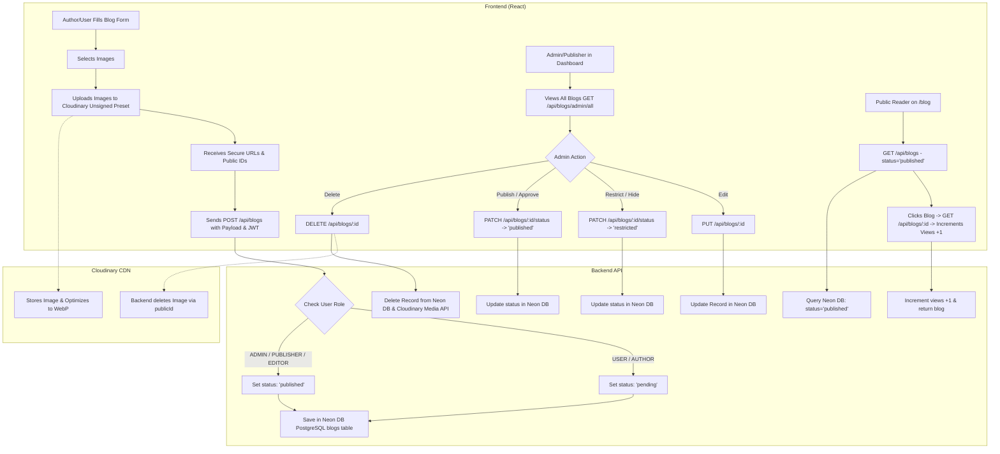

# Frontend Blog & Editorial Publishing System Integration Guide
> **Target Audience**: Frontend Developers & AI Agents implementing or connecting the Blog and Editorial system in the React application.
> **Backend Stack**: Spring Boot (REST API) + Neon DB (PostgreSQL / SQL) + Cloudinary CDN.
> **Supported Route Prefixes**: Both `/api/blogs` and `/blogpost` are fully supported.

---

## 1. System Architecture & High-Level Workflow



---

## 2. Core Frontend Rules & RBAC Permissions

| Role | Submit Article (`POST /api/blogs`) | View Public Feed (`GET /api/blogs`) | Admin Table (`GET /api/blogs/admin/all`) | Status Toggle (`PATCH /status`) | Edit Article (`PUT /:id`) | Delete (`DELETE /:id`) |
|---|---|---|---|---|---|---|
| **Public / Guest** | ❌ (Login required) | ✅ | ❌ | ❌ | ❌ | ❌ |
| **USER / AUTHOR / READER** | ✅ (`status: pending`) | ✅ | ❌ | ❌ | ✅ (Own articles only) | ❌ |
| **EDITOR** | ✅ (`status: published`) | ✅ | ✅ | ❌ | ✅ (All articles) | ✅ (All articles) |
| **PUBLISHER / ADMIN** | ✅ (`status: published`) | ✅ | ✅ | ✅ (`restricted`/`published`) | ✅ (All articles) | ✅ (All articles) |

---

## 3. Cloudinary Direct Frontend Upload Configuration

Frontend uploads images directly to Cloudinary using an unsigned preset before sending the blog payload to the backend:

- **Cloud Name**: `j9ksfgqo` (or configured via `VITE_CLOUDINARY_CLOUD_NAME`)
- **Upload Preset**: `forensic` (Unsigned)
- **Upload URL**: `https://api.cloudinary.com/v1_1/j9ksfgqo/image/upload`

### Cloudinary Upload Helper Function
```javascript
export const uploadToCloudinary = async (file, caption = '') => {
  const formData = new FormData();
  formData.append('file', file);
  formData.append('upload_preset', 'forensic');

  const response = await fetch('https://api.cloudinary.com/v1_1/j9ksfgqo/image/upload', {
    method: 'POST',
    body: formData,
  });

  if (!response.ok) {
    throw new Error('Failed to upload image to Cloudinary');
  }

  const data = await response.json();
  return {
    url: data.secure_url,
    publicId: data.public_id,
    caption: caption || file.name,
  };
};
```

---

## 4. API Endpoints Contract

### Base URL Configuration
- **Local Dev**: `http://localhost:8080`
- **Production**: Set in frontend `.env` as `VITE_API_BASE_URL` (e.g. `https://api.forensicpatrika.com`)

---

### 1. `GET /api/blogs` (Public Feed)
- **Auth**: None (Public)
- **Query Parameters**:
  - `category` *(optional)*: e.g. `Cyber Security`, `Forensic Science`, `All`
  - `search` *(optional)*: Search query (case-insensitive across title, summary, content, author)
  - `page` *(optional, default `1`)*: Page number (1-indexed)
  - `limit` *(optional, default `12`)*: Items per page
- **Response (`200 OK`)**:
```json
{
  "success": true,
  "count": 1,
  "total": 25,
  "page": 1,
  "totalPages": 3,
  "blogs": [
    {
      "_id": "664f3c8a9e1a2b3c4d5e6f7a",
      "id": "664f3c8a9e1a2b3c4d5e6f7a",
      "title": "Understanding Digital Evidence in Modern Investigations",
      "slug": "understanding-digital-evidence-in-modern-investigations-k8s9f",
      "category": "Forensic Science",
      "author": "Dr. A. Sharma",
      "authorRole": "EDITOR",
      "publishDate": "2026-08-24",
      "summary": "Exploring the fundamentals of extracting and preserving digital artifacts...",
      "content": "Full article body...",
      "readTime": "5 min read",
      "images": [
        {
          "url": "https://res.cloudinary.com/j9ksfgqo/image/upload/v1720000000/forensic/sample1.webp",
          "publicId": "forensic/sample1",
          "caption": "Digital Storage Extraction"
        }
      ],
      "tags": ["Forensics", "Digital Evidence"],
      "status": "published",
      "views": 1240,
      "likes": 0,
      "isFeatured": false,
      "createdAt": "2026-08-24T10:00:00Z",
      "updatedAt": "2026-08-24T10:00:00Z"
    }
  ]
}
```

---

### 2. `GET /api/blogs/:id` (Blog Details + View Increment)
- **Auth**: None (Public)
- **Parameters**: `:id` can be either MongoDB `_id` (24 hex characters) or article `slug`.
- **Backend Action**: Atomically increments `views` by 1.
- **Response (`200 OK`)**:
```json
{
  "success": true,
  "blog": {
    "_id": "664f3c8a9e1a2b3c4d5e6f7a",
    "id": "664f3c8a9e1a2b3c4d5e6f7a",
    "title": "Understanding Digital Evidence in Modern Investigations",
    "slug": "understanding-digital-evidence-in-modern-investigations-k8s9f",
    "category": "Forensic Science",
    "author": "Dr. A. Sharma",
    "authorEmail": "sharma@forensicpatrika.com",
    "authorRole": "EDITOR",
    "publishDate": "2026-08-24",
    "summary": "Exploring the fundamentals of extracting and preserving digital artifacts...",
    "content": "Full article markdown or HTML body...",
    "readTime": "5 min read",
    "images": [
      {
        "url": "https://res.cloudinary.com/j9ksfgqo/image/upload/v1720000000/forensic/sample1.webp",
        "publicId": "forensic/sample1",
        "caption": "Digital Storage Extraction"
      }
    ],
    "tags": ["Forensics", "Digital Evidence"],
    "status": "published",
    "views": 1241,
    "likes": 0,
    "isFeatured": false,
    "createdAt": "2026-08-24T10:00:00Z",
    "updatedAt": "2026-08-24T10:00:00Z"
  }
}
```

---

### 3. `POST /api/blogs` (Create Article)
- **Auth**: `Authorization: Bearer <token>`
- **Request Headers**: `Content-Type: application/json`
- **Request Body**:
```json
{
  "title": "Advanced Spectroscopic Analysis of Ballistic Residue",
  "category": "Ballistics",
  "author": "Dr. Indresh Kumar",
  "summary": "Comprehensive examination of primer discharge residue using SEM-EDX spectroscopy.",
  "content": "Gunshot residue (GSR) analysis represents a cornerstone in contemporary forensic ballistics...",
  "tags": ["Ballistics", "SEM-EDX", "Forensics"],
  "images": [
    {
      "url": "https://res.cloudinary.com/j9ksfgqo/image/upload/v1720000000/forensic/ballistics_fig1.jpg",
      "publicId": "forensic/ballistics_fig1",
      "caption": "SEM-EDX Spectrum"
    }
  ],
  "status": "published"
}
```
- **Behavior**:
  - If user is `ADMIN` / `PUBLISHER` / `EDITOR`: `status` is set to `"published"`.
  - If user is `USER` / `AUTHOR`: `status` is forced to `"pending"`.
  - Auto-computes `readTime` and generates unique `slug`.
- **Response (`201 Created`)**:
```json
{
  "success": true,
  "message": "Article published successfully!",
  "blog": {
    "_id": "664f3c8a9e1a2b3c4d5e6f7b",
    "id": "664f3c8a9e1a2b3c4d5e6f7b",
    "title": "Advanced Spectroscopic Analysis of Ballistic Residue",
    "status": "published"
  }
}
```

---

### 4. `GET /api/blogs/admin/all` (Admin Moderation List)
- **Auth**: `Authorization: Bearer <admin_or_editor_token>`
- **Query Parameters**:
  - `status` *(optional)*: `all`, `published`, `pending`, `restricted`, `rejected`, `draft`
  - `search` *(optional)*: Search keyword
- **Response (`200 OK`)**:
```json
{
  "success": true,
  "count": 2,
  "blogs": [
    {
      "_id": "664f3c8a9e1a2b3c4d5e6f7b",
      "title": "Advanced Spectroscopic Analysis",
      "author": "Dr. Indresh",
      "category": "Ballistics",
      "status": "published",
      "views": 450,
      "createdAt": "2026-09-04T12:00:00Z"
    },
    {
      "_id": "664f3c8a9e1a2b3c4d5e6f7c",
      "title": "Student Case Study Submission",
      "author": "Rahul S.",
      "category": "Case Studies",
      "status": "pending",
      "views": 0,
      "createdAt": "2026-09-04T13:30:00Z"
    }
  ]
}
```

---

### 5. `PATCH /api/blogs/:id/status` (Status Toggle: Restrict / Publish / Reject)
- **Auth**: `Authorization: Bearer <admin_or_publisher_token>`
- **Request Body**:
```json
{
  "status": "restricted"
}
```
- **Allowed Values**: `"published"`, `"restricted"`, `"pending"`, `"rejected"`, `"draft"`
- **Response (`200 OK`)**:
```json
{
  "success": true,
  "message": "Article status changed to 'restricted'.",
  "blog": {
    "_id": "664f3c8a9e1a2b3c4d5e6f7b",
    "status": "restricted"
  }
}
```

---

### 6. `PUT /api/blogs/:id` (Full Edit)
- **Auth**: `Authorization: Bearer <token>` (`ADMIN`, `PUBLISHER`, `EDITOR`, or original Author)
- **Request Body**: (Any updated fields)
```json
{
  "title": "Updated Title",
  "category": "Cyber Security",
  "summary": "Updated summary...",
  "content": "Updated full article body...",
  "tags": ["Cyber", "Security"],
  "images": [...]
}
```
- **Response (`200 OK`)**:
```json
{
  "success": true,
  "message": "Article updated successfully.",
  "blog": { ... }
}
```

---

### 7. `DELETE /api/blogs/:id` (Delete Article + Cloudinary Cleanup)
- **Auth**: `Authorization: Bearer <token>` (`ADMIN`, `PUBLISHER`, or original Author)
- **Backend Action**: Destroys all Cloudinary images by `publicId` and removes MongoDB document.
- **Response (`200 OK`)**:
```json
{
  "success": true,
  "message": "Article and associated assets deleted successfully."
}
```

---

## 5. Complete Frontend Service (`src/services/blogService.js`)

Copy and paste this production-ready service into your React app at `src/services/blogService.js`:

```javascript
import axios from 'axios';

const API_BASE_URL = import.meta.env.VITE_API_BASE_URL || 'http://localhost:8080';

const api = axios.create({
  baseURL: API_BASE_URL,
  withCredentials: true,
  headers: {
    'Content-Type': 'application/json',
  },
});

// Attach JWT token automatically
api.interceptors.request.use((config) => {
  const token = localStorage.getItem('token') || sessionStorage.getItem('token');
  if (token) {
    config.headers.Authorization = `Bearer ${token}`;
  }
  return config;
});

export const blogService = {
  // 1. Get published blogs for public feed
  getPublishedBlogs: async ({ category = '', search = '', page = 1, limit = 12 } = {}) => {
    const params = {};
    if (category && category !== 'All') params.category = category;
    if (search) params.search = search;
    if (page) params.page = page;
    if (limit) params.limit = limit;

    const response = await api.get('/api/blogs', { params });
    return response.data;
  },

  // 2. Get blog details by ID or Slug (increments view count)
  getBlogById: async (idOrSlug) => {
    const response = await api.get(`/api/blogs/${idOrSlug}`);
    return response.data;
  },

  // 3. Create a new blog
  createBlog: async (blogData) => {
    const response = await api.post('/api/blogs', blogData);
    return response.data;
  },

  // 4. Get admin blogs moderation list
  getAdminBlogs: async ({ status = 'all', search = '' } = {}) => {
    const params = {};
    if (status && status !== 'all') params.status = status;
    if (search) params.search = search;

    const response = await api.get('/api/blogs/admin/all', { params });
    return response.data;
  },

  // 5. Update status (Publish, Restrict, Reject)
  updateBlogStatus: async (id, status) => {
    const response = await api.patch(`/api/blogs/${id}/status`, { status });
    return response.data;
  },

  // 6. Full edit of a blog
  updateBlog: async (id, updateData) => {
    const response = await api.put(`/api/blogs/${id}`, updateData);
    return response.data;
  },

  // 7. Delete blog and delete associated Cloudinary images
  deleteBlog: async (id) => {
    const response = await api.delete(`/api/blogs/${id}`);
    return response.data;
  },

  // Direct Cloudinary Upload Helper
  uploadImageToCloudinary: async (file, caption = '') => {
    const formData = new FormData();
    formData.append('file', file);
    formData.append('upload_preset', 'forensic');

    const res = await fetch('https://api.cloudinary.com/v1_1/j9ksfgqo/image/upload', {
      method: 'POST',
      body: formData,
    });

    if (!res.ok) {
      throw new Error('Image upload failed');
    }

    const data = await res.json();
    return {
      url: data.secure_url,
      publicId: data.public_id,
      caption: caption || file.name,
    };
  },
};

export default blogService;
```

---

## 6. React Component Implementation Examples

### Example A: Author Submission Form (`Blogpublish.jsx`)
```jsx
import React, { useState } from 'react';
import blogService from '../../services/blogService';

export default function BlogPublish() {
  const [formData, setFormData] = useState({
    title: '',
    category: 'Forensic Science',
    summary: '',
    content: '',
    tags: '',
  });
  const [images, setImages] = useState([]);
  const [uploading, setUploading] = useState(false);
  const [message, setMessage] = useState('');

  const handleImageUpload = async (e) => {
    const files = Array.from(e.target.files);
    if (images.length + files.length > 4) {
      alert('Maximum 4 images allowed.');
      return;
    }

    setUploading(true);
    try {
      const uploaded = await Promise.all(
        files.map((file) => blogService.uploadImageToCloudinary(file))
      );
      setImages((prev) => [...prev, ...uploaded]);
    } catch (err) {
      alert('Failed to upload image to Cloudinary.');
    } finally {
      setUploading(false);
    }
  };

  const handleSubmit = async (e) => {
    e.preventDefault();
    try {
      const payload = {
        ...formData,
        tags: formData.tags.split(',').map((t) => t.trim()).filter(Boolean),
        images,
      };
      const res = await blogService.createBlog(payload);
      setMessage(res.message || 'Article submitted successfully!');
    } catch (err) {
      alert(err.response?.data?.message || 'Submission failed');
    }
  };

  return (
    <div className="max-w-4xl mx-auto p-6">
      <h1 className="text-2xl font-bold mb-4">Publish or Submit Article</h1>
      {message && <div className="p-3 bg-green-100 text-green-700 rounded mb-4">{message}</div>}
      
      <form onSubmit={handleSubmit} className="space-y-4">
        <div>
          <label className="block text-sm font-medium">Article Title</label>
          <input
            type="text"
            required
            className="w-full border p-2 rounded"
            value={formData.title}
            onChange={(e) => setFormData({ ...formData, title: e.target.value })}
          />
        </div>

        <div>
          <label className="block text-sm font-medium">Category</label>
          <select
            className="w-full border p-2 rounded"
            value={formData.category}
            onChange={(e) => setFormData({ ...formData, category: e.target.value })}
          >
            <option>Forensic Science</option>
            <option>Cyber Security</option>
            <option>Criminology</option>
            <option>Legal & Ethics</option>
            <option>Case Studies</option>
            <option>Digital Forensics</option>
            <option>DNA & Toxicology</option>
            <option>Ballistics</option>
            <option>General</option>
          </select>
        </div>

        <div>
          <label className="block text-sm font-medium">Summary</label>
          <textarea
            className="w-full border p-2 rounded"
            rows="2"
            value={formData.summary}
            onChange={(e) => setFormData({ ...formData, summary: e.target.value })}
          />
        </div>

        <div>
          <label className="block text-sm font-medium">Content Body</label>
          <textarea
            required
            className="w-full border p-2 rounded font-mono"
            rows="8"
            value={formData.content}
            onChange={(e) => setFormData({ ...formData, content: e.target.value })}
          />
        </div>

        <div>
          <label className="block text-sm font-medium">Upload Evidence Images (Max 4)</label>
          <input type="file" multiple accept="image/*" onChange={handleImageUpload} />
          {uploading && <p className="text-sm text-blue-500">Uploading to Cloudinary...</p>}
          <div className="flex gap-2 mt-2">
            {images.map((img, idx) => (
              
            ))}
          </div>
        </div>

        <button type="submit" disabled={uploading} className="px-6 py-2 bg-blue-600 text-white rounded hover:bg-blue-700">
          Submit Article
        </button>
      </form>
    </div>
  );
}
```

---

### Example B: Admin Moderation Table with Restrict / Publish Toggle
```jsx
import React, { useEffect, useState } from 'react';
import blogService from '../../services/blogService';

export default function AdminBlogModeration() {
  const [blogs, setBlogs] = useState([]);
  const [filter, setFilter] = useState('all');

  const loadBlogs = async () => {
    try {
      const data = await blogService.getAdminBlogs({ status: filter });
      setBlogs(data.blogs || []);
    } catch (err) {
      console.error(err);
    }
  };

  useEffect(() => {
    loadBlogs();
  }, [filter]);

  const handleStatusToggle = async (id, currentStatus) => {
    const nextStatus = currentStatus === 'published' ? 'restricted' : 'published';
    try {
      await blogService.updateBlogStatus(id, nextStatus);
      loadBlogs();
    } catch (err) {
      alert('Failed to update status');
    }
  };

  const handleDelete = async (id) => {
    if (!window.confirm('Delete article and all associated Cloudinary images?')) return;
    try {
      await blogService.deleteBlog(id);
      loadBlogs();
    } catch (err) {
      alert('Delete failed');
    }
  };

  return (
    <div className="p-6">
      <div className="flex justify-between items-center mb-6">
        <h1 className="text-2xl font-bold">Blog Moderation & Editorial</h1>
        <select value={filter} onChange={(e) => setFilter(e.target.value)} className="border p-2 rounded">
          <option value="all">All Articles</option>
          <option value="published">Published</option>
          <option value="pending">Pending Moderation</option>
          <option value="restricted">Restricted / Hidden</option>
        </select>
      </div>

      <table className="w-full border-collapse border border-gray-200">
        <thead>
          <tr className="bg-gray-50 text-left">
            <th className="p-3 border">Title</th>
            <th className="p-3 border">Author</th>
            <th className="p-3 border">Status</th>
            <th className="p-3 border">Views</th>
            <th className="p-3 border">Actions</th>
          </tr>
        </thead>
        <tbody>
          {blogs.map((b) => (
            <tr key={b._id || b.id} className="border-b">
              <td className="p-3 font-medium">{b.title}</td>
              <td className="p-3">{b.author}</td>
              <td className="p-3">
                <span className={`px-2 py-1 rounded text-xs font-semibold ${
                  b.status === 'published' ? 'bg-green-100 text-green-800' :
                  b.status === 'restricted' ? 'bg-amber-100 text-amber-800' :
                  'bg-blue-100 text-blue-800'
                }`}>
                  {b.status.toUpperCase()}
                </span>
              </td>
              <td className="p-3">{b.views || 0}</td>
              <td className="p-3 space-x-2">
                <button
                  onClick={() => handleStatusToggle(b._id || b.id, b.status)}
                  className={`px-3 py-1 text-xs rounded text-white ${
                    b.status === 'published' ? 'bg-amber-600' : 'bg-green-600'
                  }`}
                >
                  {b.status === 'published' ? 'Restrict / Hide' : 'Publish / Approve'}
                </button>
                <button
                  onClick={() => handleDelete(b._id || b.id)}
                  className="px-3 py-1 text-xs bg-red-600 text-white rounded"
                >
                  Delete
                </button>
              </td>
            </tr>
          ))}
        </tbody>
      </table>
    </div>
  );
}
```

---

## 7. Troubleshooting & Common Pitfalls

1. **CORS Error**:
   - Ensure the React dev server is running on `http://localhost:5173` (configured in backend `CorsConfig.java`).
   - For credentials/cookies, `withCredentials: true` is enabled in `blogService.js`.
2. **Missing Authorization Header**:
   - Make sure your login flow saves the JWT token to `localStorage.setItem('token', token)` upon login.
3. **Cloudinary Asset Uploads**:
   - Ensure image uploads use the unsigned preset name `forensic` and cloud name `j9ksfgqo`.
   - When submitting a blog, pass `images: [{ url, publicId, caption }]` so the backend can manage and delete assets later.
